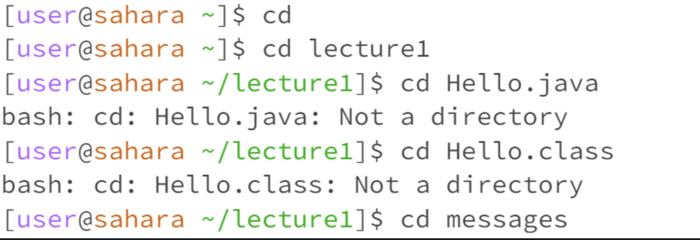
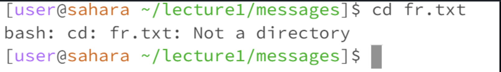
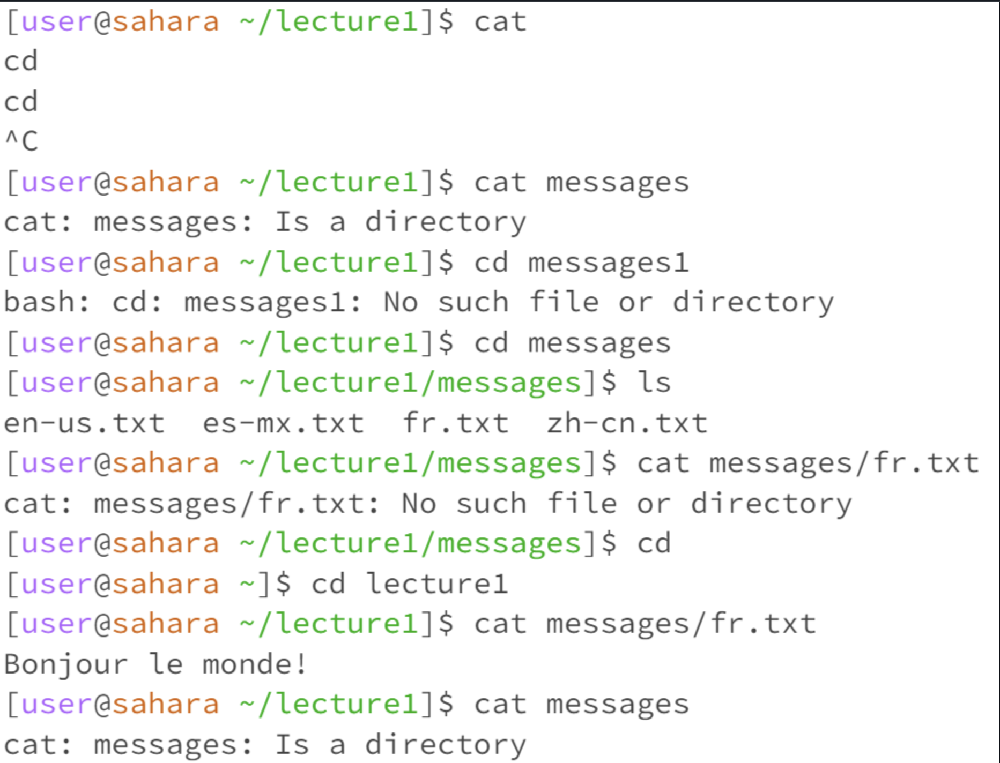
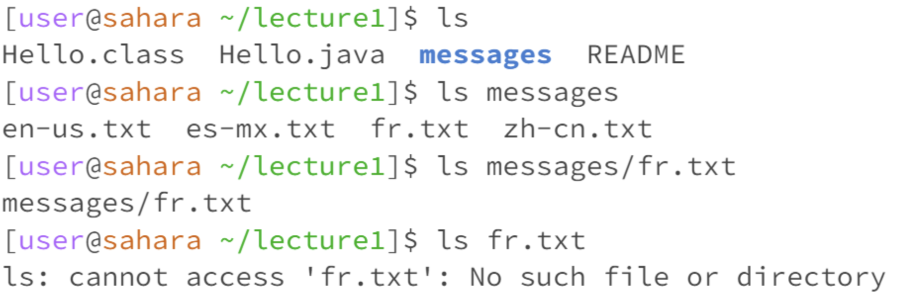

---
Cd changes the directory. Cd with no arguments does not output anything. When typing cd with a path to directory, it accesses the folder being called. When typing cd with a file name would be an error since it is not a directory.
---

---
Cat with no argument outputs nothing. Cat using a path to a directory will create an error because it is a directory. Cat using a parth to a file will print out the contents of the file.
---

---
Ls with no argument lists out the contents. Ls with a path to a directory will show the contents of the directory. Ls with a file name will be an error because there is nothing to list.
